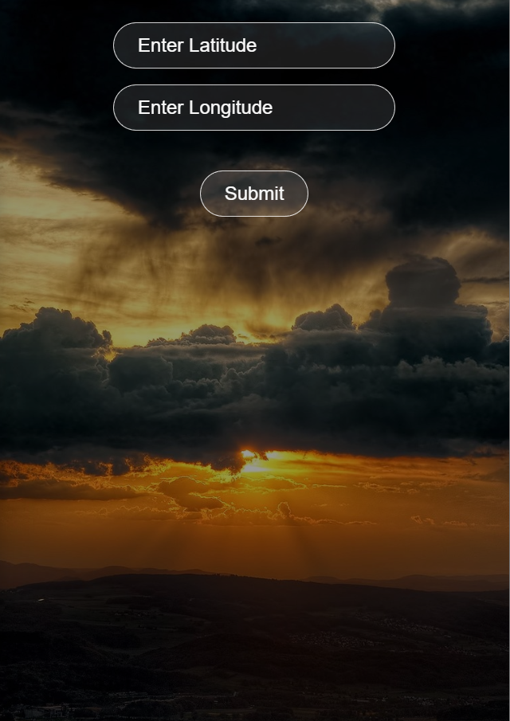
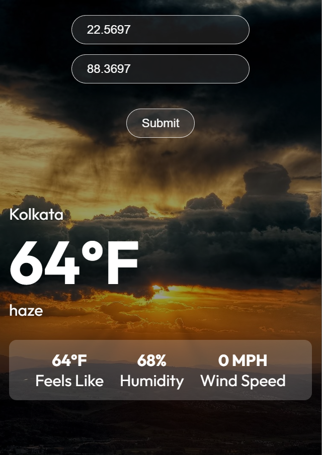

# CodeHall Assignment

In this project, I have made a weather app  which calls a public API to fetch the weather details, taking latitude and longitude as the parameters from the user.

First, we subscribe to the public API from openweathermap. We get an API key which we use as a parameter in the API endpoint, along with the latitude and longitude.

The API endpoint is: 

### `https://api.openweathermap.org/data/3.0/onecall?lat={lat}&lon={lon}&exclude={part}&appid={API key}`

You must enter a latitude and longitude in the provided input areas.

On clicking Submit, we show the weather details of the particular location, such as the location name, temperature in Fahrenheit and additional information such as feels like temperature, humidity and wind speed.

You can run the project by the following command:

### `npm start`

Runs the app in the development mode.\
Open [http://localhost:3000](http://localhost:3000) to view it in your browser.

The initial web UI looks like this:

On entering the latitude and longitude and clicking Submit, we display the weather information.

